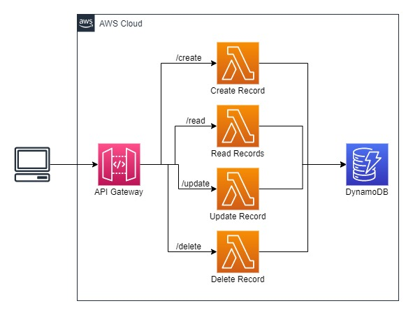

# Complete CRUD Application with AWS Serverless
## Architecture


Let me explain the simple architecture and which AWS service is used for which purposes in the above architecture.
- API Gateway: It is used to create API to communicate with backend services on a particular path.
- Lambda Function: It is used to perform a particular task, such create a new record, updating a record, reading all records, delete a record.
- DynamoDB: It is used to store all records.

## Pre-requisites

- A node.js and npm must be installed on your machine. You can download node.js from this website: https://nodejs.org/en/download/
- Serverless Framework must be installed on your machine. You can install Serverless Framework using the below command. For installation, you can follow the official documentation https://www.serverless.com/framework/docs/getting-started
```
npm install -g serverless
```
- AWS CLI must be installed on your machine, and AWS Credentials must be configured.
- AWS Credentials must be configured. However, if you have installed AWS CLI previously and configured AWS Credentials before then, you don't need to set up AWS Credentials because Serverless Framework will fetch your AWS Credentials automatically.
- If you haven't configured AWS Credentials yet, you need to get your AWS Credentials from the AWS Console, and you can also configure credentials via Serverless Framework. To do that and for more information, refer to the below link.
https://www.serverless.com/framework/docs/providers/aws/guide/credentials

## Implementation
- Clone the GitHub repository, go to that repository, and open that project in any code editor.
https://github.com/ParthTrambadiya/crud-application-sf
```
git clone https://github.com/ParthTrambadiya/crud-application-sf.git
cd crud-application-sf
```
- Install dependencies by the below command.
```
npm install
```
- Now, we are ready to deploy our stack on AWS. To do that, run the below command.
```
serverless deploy --region <aws-region> --stage <project-stage>
```
- Once the stack is deployed successfully, one new file will be created in the root directory of your project with the name stack-output.json.
- Copy the following values from the stack-output.json file, ApiBaseUri, StackStage, and paste in any text editor.
- Now, we need to provide ApiBaseUrl and StackStage to our javascript code to call API, for that update these values in app/js/config.js a file.
- Now you are ready to test your CRUD application.

## Cleanup
- Open a terminal in the root of the project and run the below command to remove a deployed stack.
```
serverless remove --region <aws-region> --stage <stack-stage>
```

---
### Visit the below my blog post:


https://enlear.academy/complete-crud-application-with-aws-serverless-6538e9dca7c1
